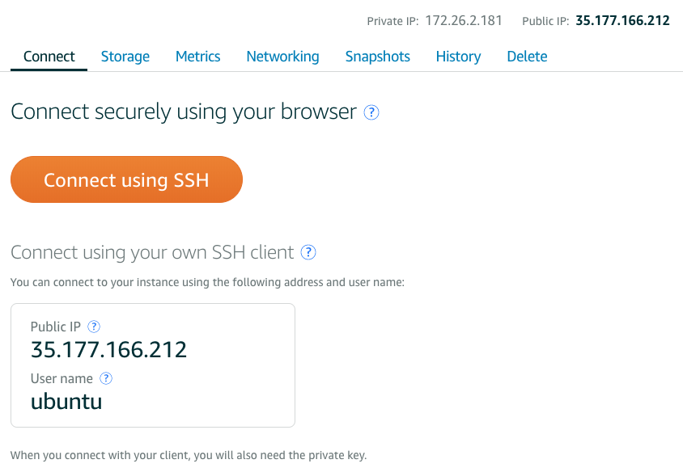
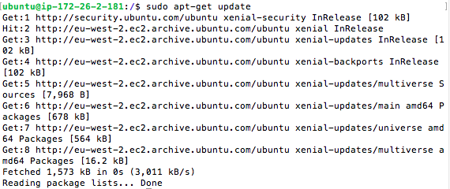
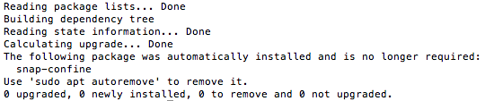
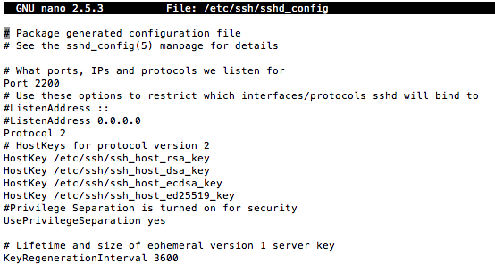
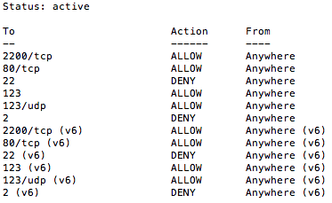
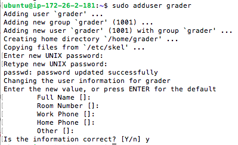
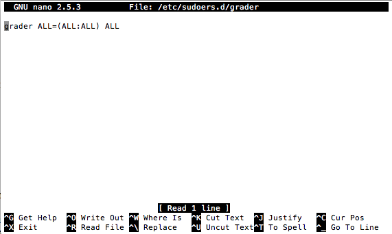
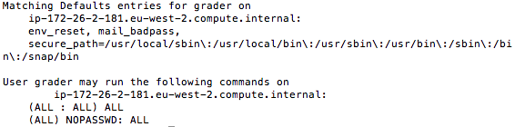
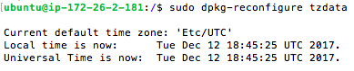

# Linux Server Configuration - Udacity Project
## Get your server.
1. Start a new Ubuntu Linux server instance on Amazon Lightsail. There are full details on setting up your Lightsail instance on the next page.c



2. Follow the instructions provided to SSH into your server. ✅ 
   
```sh
ssh -i ~/.ssh/LinuxServerProjectUdacity.rsa -p 2200 ubuntu@35.177.166.212
```

## Secure your server.
3. Update all currently installed packages. ✅ 





4. Change the SSH port from 22 to 2200. Make sure to configure the Lightsail firewall to allow it. ✅ 



5. Configure the Uncomplicated Firewall (UFW) to only allow incoming connections for SSH (port 2200), HTTP (port 80), and NTP (port 123). ✅ 



## Give grader access.
In order for your project to be reviewed, the grader needs to be able to log in to your server.

6. Create a new user account named grader. ✅ 




7. Give grader the permission to sudo. ✅ 





8. Create an SSH key pair for grader using the ssh-keygen tool. ✅ 

```sh
ssh -i ~/.ssh/grader_key -p 2200 grader@35.177.166.212
```

Prepare to deploy your project.
9. Configure the local timezone to UTC. ✅



10. Install and configure Apache to serve a Python mod_wsgi application. ✅ 

```sh
sudo apt-get install apache2
```

11. Install and configure PostgreSQL:

Do not allow remote connections ✅ 


Create a new database user named catalog that has limited permissions to your catalog application database. ✅ 


12. Install git. ✅ 


## Deploy the Item Catalog project. ❌ 

13. Clone and setup your Item Catalog project from the Github repository you created earlier in this Nanodegree program. ✅ 

14. Set it up in your server so that it functions correctly when visiting your server’s IP address in a browser. Make sure that your .git directory is not publicly accessible via a browser! ❌ 
(The public IP is: http://35.177.166.212/, but after configuring the server I only see the default Ubuntu page. I have tried several things but i can't resolve it)
